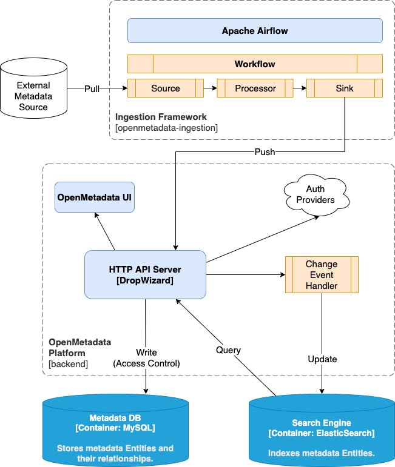

# 🗂️ Metadata Manager


---

## 🧩 Overview

**Metadata Manager** is a comprehensive, production-ready metadata management platform inspired by OpenMetadata, built with Django and following modern microservices architecture.

## Architecture





---

## 🧰 Getting Started

### 📋 Prerequisites

Make sure you have the following installed before proceeding:

- **Python 3.8+**  
- **pip** package manager  
- (Optional) **virtual environment** for isolation

---

### ⚙️ Installation

Clone the repository and install dependencies:

```bash
git clone https://github.com/Meet2197/metadata_manager.git
cd metadata_manager
```

### (Optional) create a virtual environment
```bash
python -m venv venv
source venv/bin/activate  # macOS/Linux
venv\Scripts\activate     # Windows
```
### Install dependencies
```bash
pip install -r requirements.txt
```

# 🔧 Configuration

You can configure the project by editing the config.yaml file or creating a .env file.

Example config.yaml:

```bash
database:
  type: sqlite
  path: ./data/metadata.db

schema:
  directory: ./schemas
```

# 🧠 Usage

```bash
Run the metadata manager from the command line.
```
Initialize metadata storage
```bash
python manage.py init
```

Create a metadata record
```bash
python manage.py create --schema user --data user1.json
```

List all metadata records
```bash
python manage.py list --schema document
```

Update a metadata record
```bash
python manage.py update --id 123 --data update.json
```

Delete a metadata record
```bash
python manage.py delete --id 123
```

(Adjust commands to match your CLI interface if needed.)

### 📁 Example
Example Schema (schemas/user_schema.json)
```bash
{
  "schema": "user",
  "fields": [
    { "name": "id", "type": "integer" },
    { "name": "name", "type": "string" },
    { "name": "email", "type": "string" },
    { "name": "created_at", "type": "datetime" }
  ]
}
```

Example Metadata Record (data/user1.json)
```bash
{
  "id": 1,
  "name": "Alice Smith",
  "email": "alice@example.com",
  "created_at": "2025-11-12T10:00:00Z"
}
```

# 🧱 Project Structure

```bash
metadata_manager/
├── bin
├── manage.py
├── requirements.txt
├── metadata_manager/      # Project settings
├── metadata/              # Main app
│   ├── models.py         # Data models
│   ├── views.py          # View logic
│   ├── forms.py          # Forms
│   ├── urls.py           # URL routing
│   └── admin.py          # Admin interface
│ templates/            # HTML templates
│ static/    
├── setup.sh
```

# 🧪 Testing

To run unit tests (if available):
```bash
pytest
```

You can also use tox or other testing frameworks if configured.

# 🤝 Contributing

Contributions are welcome! To get started:

Fork the repository

Create a feature branch
```bash
git checkout -b feature/your-feature-name
```

Make your changes and commit them
```bash
git commit -m "Add your feature description"
```

Push your branch
```bash
git push origin feature/your-feature-name
```

Open a Pull Request

Please make sure your code follows existing style conventions and includes documentation/tests for new features.

# 🧾 License

This project is licensed under the MIT License.
See the LICENSE
 file for details.

# 📬 Contact

For feedback, questions, or collaborations:

GitHub: @Meet2197

Repository: Metadata Manager

# ⭐ Support

If you find this project helpful, consider giving it a ⭐ on GitHub to show your support!

✨ Built with care to make metadata management simple, scalable, and developer-friendly.
## Features

### Core Functionality
- **Metadata Ingestion**: Pull metadata from various sources (MySQL, PostgreSQL, MongoDB, APIs, etc.)
- **Metadata Storage**: Store and manage metadata entities and relationships
- **Search & Discovery**: Full-text search powered by Elasticsearch
- **Data Lineage**: Track data flow and dependencies between tables
- **Access Control**: Role-based access control and permissions
- **Change Events**: Audit trail and change notifications
- **Business Glossary**: Define and manage business terms

### Technical Features
- RESTful API with Django REST Framework
- JWT authentication
- Asynchronous task processing with Celery
- Event-driven architecture with RabbitMQ
- Full-text search with Elasticsearch
- Containerized with Docker
- Production-ready with proper logging and monitoring

## Installation

### Prerequisites
- Python 3.11+
- Docker and Docker Compose
- MySQL 8.0+ or PostgreSQL 13+
- Redis 7+
- Elasticsearch 8+
- RabbitMQ 3+

### Quick Start with Docker

1. Clone the repository:
```bash
git clone https://github.com/yourusername/metadata-platform.git
cd metadata-platform
```

2. Copy environment file:
```bash
cp .env.example .env
# Edit .env with your configuration
```

3. Start services:
```bash
docker-compose up -d
```

4. Run migrations:
```bash
docker-compose exec web python manage.py migrate
```

5. Create superuser:
```bash
docker-compose exec web python manage.py createsuperuser
```

6. Access the platform:
- API: http://localhost:8000/api/v1/
- Admin: http://localhost:8000/admin/

### Manual Installation

1. Create virtual environment:
```bash
python -m venv venv
source venv/bin/activate  # On Windows: venv\Scripts\activate
```

2. Install dependencies:
```bash
pip install -r requirements.txt
```

3. Set up database:
```bash
python manage.py migrate
```

4. Create superuser:
```bash
python manage.py createsuperuser
```

5. Run development server:
```bash
python manage.py runserver
```

6. Start Celery worker (in another terminal):
```bash
celery -A config worker -l info
```

7. Start Celery beat (in another terminal):
```bash
celery -A config beat -l info
```

## API Usage

### Authentication

Get JWT token:
```bash
curl -X POST http://localhost:8000/api/token/ \
  -H "Content-Type: application/json" \
  -d '{"username": "admin", "password": "password"}'
```

### Create Data Source
```bash
curl -X POST http://localhost:8000/api/v1/datasources/ \
  -H "Authorization: Bearer YOUR_TOKEN" \
  -H "Content-Type: application/json" \
  -d '{
    "name": "my_mysql_db",
    "display_name": "My MySQL Database",
    "source_type": "mysql",
    "connection_config": {
      "host": "localhost",
      "port": 3306,
      "database": "mydb",
      "username": "user",
      "password": "pass"
    }
  }'
```

### Sync Metadata
```bash
curl -X POST http://localhost:8000/api/v1/datasources/{id}/sync/ \
  -H "Authorization: Bearer YOUR_TOKEN"
```

### Search
```bash
curl -X GET "http://localhost:8000/api/v1/search/?q=customer&type=table" \
  -H "Authorization: Bearer YOUR_TOKEN"
```

### Get Table Lineage
```bash
curl -X GET http://localhost:8000/api/v1/tables/{id}/lineage/ \
  -H "Authorization: Bearer YOUR_TOKEN"
```

## Management Commands

### Sync metadata from all sources
```bash
python manage.py sync_metadata --all
```

### Sync specific source
```bash
python manage.py sync_metadata --source-id=
```

### Reindex search
```bash
python manage.py reindex_search --entity-type=all
```

## Development

### Project Structure
```
metadata_platform/
├── config/              # Django settings and configuration
├── core/                # Core models, services, repositories
├── ingestion/           # Metadata ingestion framework
├── api/                 # REST API views and serializers
├── search/              # Elasticsearch integration
├── events/              # Event handling and publishing
├── auth_providers/      # Authentication providers
├── ui/                  # Web UI (optional)
├── tests/               # Test suite
└── docker-compose.yml   # Docker configuration
```

### Running Tests
```bash
python manage.py test
```

### Code Style
```bash
flake8 .
black .
isort .
```

## Deployment

### Production Checklist
- [ ] Set `DEBUG=False`
- [ ] Configure proper `SECRET_KEY`
- [ ] Set up SSL/TLS certificates
- [ ] Configure database connection pooling
- [ ] Set up Redis for caching
- [ ] Configure Elasticsearch cluster
- [ ] Set up monitoring (Prometheus, Grafana)
- [ ] Configure log aggregation
- [ ] Set up backup strategy
- [ ] Configure rate limiting

### Environment Variables
See `.env.example` for all available configuration options.

## Contributing
Contributions are welcome! Please read CONTRIBUTING.md for details.

## License
MIT License - see LICENSE file for details.

## Support
For issues and questions, please open a GitHub issue.